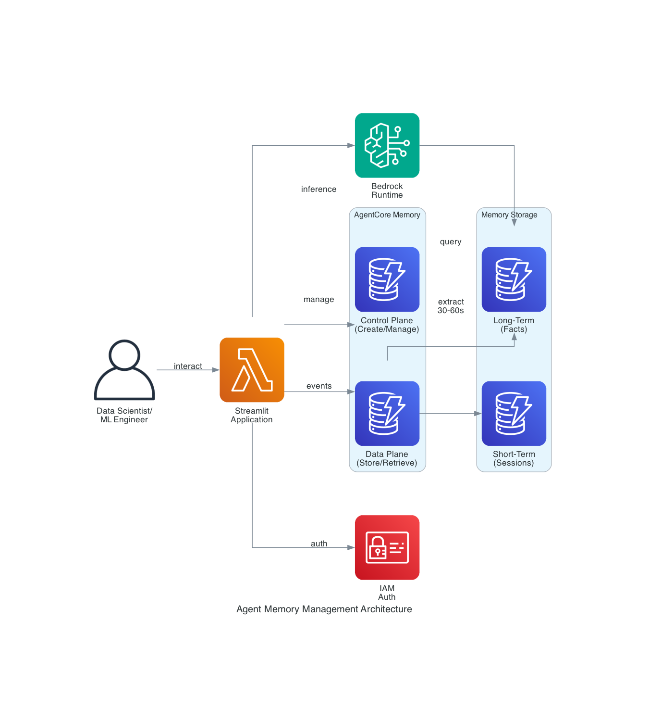

# Amazon Bedrock Agent Memory Management

A comprehensive Streamlit application demonstrating memory-enabled AI agents using Amazon Bedrock AgentCore. This application showcases both short-term conversational memory and long-term persistent knowledge across sessions.


## 🏗️ Architecture



The application integrates with Amazon Bedrock AgentCore Memory to provide:
- **Short-Term Memory**: Session-scoped conversational context
- **Long-Term Memory**: User-scoped extracted facts with semantic search
- **Automatic Extraction**: Background process extracts stable facts (30-60s)
- **Seamless Integration**: Agent automatically queries relevant memories

## 🎯 What This Does

Think of it like teaching an AI agent to remember conversations (short-term memory) and learn about users over time (long-term memory) - just like a barista who remembers your usual order.

**Perfect for:**
- Data Scientists learning agent memory concepts
- ML Engineers building production agentic systems
- AWS Architects designing scalable AI solutions

## ✨ Features

- **Memory Resource Management** - Create and configure memory resources
- **Short-Term Memory** - Maintain conversational context within sessions
- **Long-Term Memory** - Extract and persist facts across sessions
- **Interactive Agent Chat** - Chat with a memory-enabled agent
- **Semantic Search** - Query extracted facts and preferences
- **Production-Ready** - Error handling, monitoring, and best practices

## 🚀 Quick Start

### Prerequisites

- Python 3.10+
- AWS account with Bedrock access
- AWS credentials configured

### Installation

```bash
# Clone the repository
git clone https://github.com/anespo/agents_memory_sample.git
cd agent-memory_sample

# Install dependencies
pip install -r requirements.txt

# Verify setup (optional)
python verify_setup.py

# Run the application
streamlit run app.py
```

The app will open at `http://localhost:8501`

### AWS Configuration

Configure your AWS credentials in `~/.aws/credentials`:

```ini
[default]
aws_access_key_id = YOUR_ACCESS_KEY
aws_secret_access_key = YOUR_SECRET_KEY
region = eu-west-1
```

Ensure you have:
- Access to Amazon Bedrock AgentCore
- Access to Bedrock foundation models (Claude, etc.)
- Appropriate IAM permissions

## 📱 Application Overview

The application has 4 main sections:

### 1. Setup Tab
- Create memory resources
- Enable long-term strategies (user preferences, summaries, semantic facts)
- Monitor resource status
- Clean up resources

### 2. Short-Term Memory
- Add sample conversational events
- View session history
- Understand how context is maintained

### 3. Long-Term Memory
- Semantic search across extracted facts
- Query user preferences
- Test cross-session retrieval

### 4. Agent Chat
- Interactive chat with memory-enabled agent
- Toggle long-term memory retrieval
- Experience personalized responses

## 🧠 Memory Concepts

### Short-Term Memory
Maintains conversational context within a single session. Essential for the agent to understand follow-up questions and maintain coherence.

- **Scope**: Session-specific
- **Storage**: Raw conversational events
- **Access**: Immediate
- **Use Case**: "What did I just ask?" "Tell me more about that"

### Long-Term Memory
Stores stable facts extracted from conversations, enabling personalization across sessions.

- **Scope**: User-specific (actor-scoped)
- **Storage**: Extracted facts and preferences
- **Access**: Semantic search
- **Extraction**: Asynchronous (30-60 seconds)
- **Use Case**: "What's my usual order?" "Remember my preferences"

### Memory Strategies

1. **User Preference** - Learns likes/dislikes
2. **Summary** - Creates session summaries
3. **Semantic** - Extracts general facts

## 🏗️ Architecture

```
Streamlit UI
    ↓
Application Logic (app.py)
    ↓
    ├─→ Boto3 → AgentCore Memory
    │           - Create/manage memory
    │           - Store/retrieve events
    │           - Query long-term memory
    │
    └─→ Strands Agent SDK → Bedrock Runtime
                           - Agent inference
                           - Tool execution
```

## 📚 Example Scripts

Individual learning examples are provided:

1. `example_1_basic_agent.py` - Basic agent without memory
2. `example_2_create_memory.py` - Create memory resource
3. `example_3_add_retrieve_events.py` - Work with events
4. `example_4_agent_with_memory.py` - Agent with short-term memory
5. `example_5_add_longterm_strategy.py` - Enable long-term strategies
6. `example_6_query_longterm_memory.py` - Query long-term memory
7. `example_7_agent_with_longterm_memory.py` - Full memory agent
8. `example_9_cleanup_memory.py` - Clean up resources

Run individually:
```bash
python example_1_basic_agent.py
```

## 🔧 Configuration

### Application Settings

Edit `app.py` to change:
- AWS region (default: eu-west-1)
- AWS profile name (default: default)
- Memory expiry duration (default: 90 days)

### Memory Strategies

Enable strategies in the Setup tab or programmatically:
```python
strategies = ["user_preference", "summary", "semantic"]
```

## 💡 Use Cases

### Customer Support
- Remember customer preferences across interactions
- Maintain context within support sessions
- Personalize responses based on history

### Personal Assistant
- Learn user preferences over time
- Maintain conversation context
- Provide personalized recommendations

### Data Analysis Agent
- Remember preferred tools and frameworks
- Maintain analysis context across sessions
- Personalize data insights

## 🛠️ Troubleshooting

### Memory Not Active
Wait 5-10 seconds after creation for the memory resource to become active.

### No Long-Term Memories Found
- Wait 30-60 seconds after adding events for extraction
- Ensure long-term strategies are enabled
- Verify events were added to the correct session

### AWS Credentials Error
- Verify credentials exist in `~/.aws/credentials`
- Check IAM permissions for Bedrock AgentCore
- Ensure Bedrock model access is enabled

### OpenTelemetry Dependency Conflicts
```bash
pip install --upgrade -r requirements.txt
```

For more issues, see [TROUBLESHOOTING.md](TROUBLESHOOTING.md)

## 📖 Documentation

- **QUICKSTART.md** - 5-minute getting started guide
- **TROUBLESHOOTING.md** - Common issues and solutions
- **BLOG.md** - Detailed blog post about the project

## 🔐 Security Best Practices

- Never commit AWS credentials to version control
- Use IAM roles instead of access keys when possible
- Follow principle of least privilege for IAM permissions
- Regularly rotate credentials
- Enable CloudTrail for audit logging

## 💰 Cost Considerations

Typical costs per user per month:
- Memory storage: ~$0.001-0.005
- API operations: ~$0.01-0.05
- LLM inference: ~$0.01-0.05
- **Total**: ~$0.02-0.10 per user/month

## 🤝 Contributing

Contributions are welcome! Please feel free to submit a Pull Request.

## 📝 License

This project is licensed under the MIT License - see the LICENSE file for details.

## 🙏 Acknowledgments

- Built with [Strands Agents SDK](https://github.com/awslabs/strands-agents)
- Powered by [Amazon Bedrock AgentCore](https://aws.amazon.com/bedrock/)
- UI built with [Streamlit](https://streamlit.io/)

## 📞 Support

- AWS Bedrock Documentation: https://docs.aws.amazon.com/bedrock/
- Strands Agents SDK: https://github.com/awslabs/strands-agents
- Issues: [GitHub Issues](your-repo-url/issues)

## 🚀 What's Next?

1. Try the application with sample data
2. Experiment with different memory strategies
3. Build your own memory-enabled agents
4. Deploy to production using the deployment checklist

---

**Built for Data Scientists, ML Engineers, and AWS Architects**  
**Technology**: Amazon Bedrock AgentCore | Strands Agents SDK | Streamlit
